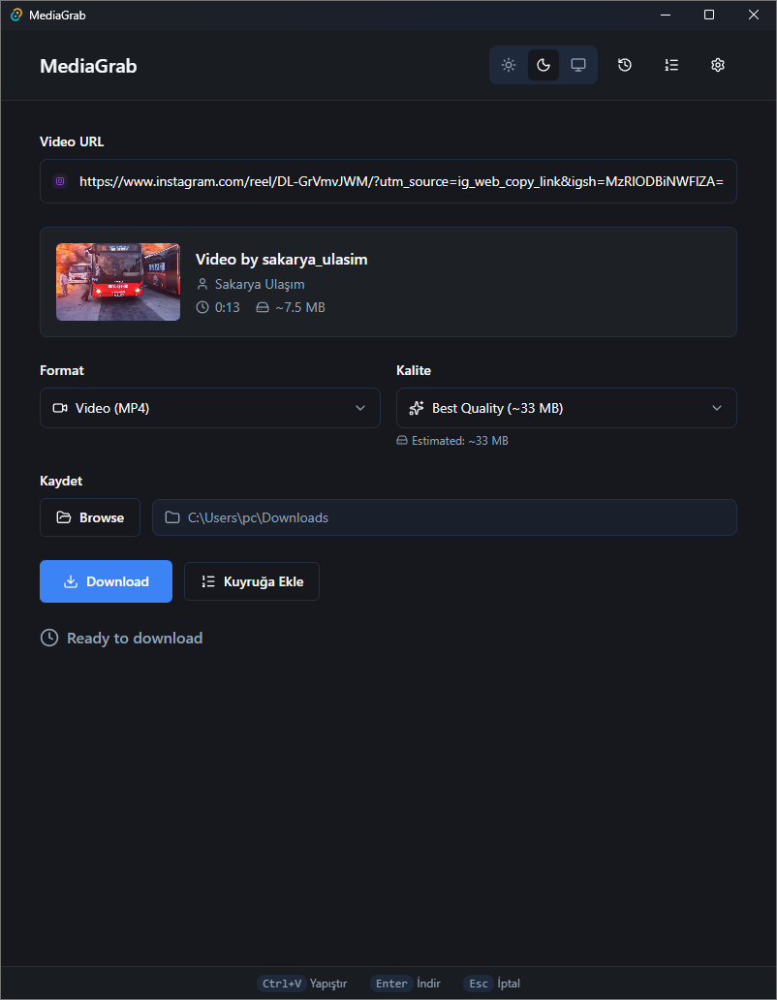

<p align="center">
  
</p>

<h1 align="center">🎬 MediaGrab</h1>

<p align="center">
  <strong>Modern, hızlı ve kullanıcı dostu medya indirme uygulaması</strong>
</p>

<p align="center">
  <a href="#özellikler">Özellikler</a> •
  <a href="#kurulum">Kurulum</a> •
  <a href="#kullanım">Kullanım</a> •
  <a href="#geliştirme">Geliştirme</a> •
  <a href="#lisans">Lisans</a>
</p>

<p align="center">
  
  
  
  
</p>

---

## 📖 Hakkında

**MediaGrab**, YouTube ve diğer popüler platformlardan video ve ses dosyalarını indirmenizi sağlayan modern bir masaüstü uygulamasıdır. [yt-dlp](https://github.com/yt-dlp/yt-dlp) ve [FFmpeg](https://ffmpeg.org/) güçlü altyapısını kullanarak, kullanıcı dostu bir arayüz sunar.


## ✨ Özellikler

### 🎯 Temel Özellikler
- **🎥 Video İndirme** - YouTube, Vimeo, Twitter ve 1000+ desteklenen siteden video indirin
- **🎵 Ses Çıkarma** - Videolardan MP3, AAC, OPUS, FLAC, WAV formatlarında ses çıkarın
- **📊 Kalite Seçimi** - 720p, 1080p veya en iyi kaliteyi seçin
- **📁 Özel Klasör** - İndirme konumunu dilediğiniz gibi ayarlayın
- **📋 Playlist Desteği** - YouTube playlistlerini algılayın ve seçili videoları indirin
- **📜 Altyazı Desteği** - Mevcut altyazıları görüntüleyin ve videolara gömün

### 🎨 Kullanıcı Deneyimi
- **🌙 Tema Özelleştirme** - Açık/Koyu/Sistem tema modu seçimi
- **🎨 Accent Renkleri** - 8 farklı vurgu rengi (Mavi, Mor, Yeşil, Turuncu, Pembe, Kırmızı, Turkuaz, Sarı)
- **🌍 Çoklu Dil** - Türkçe, İngilizce ve Almanca dil desteği
- **📱 Modern Arayüz** - Tailwind CSS ile tasarlanmış şık ve responsive tasarım
- **⚡ Gerçek Zamanlı İlerleme** - İndirme durumunu anlık takip edin
- **🔔 Bildirimler** - İndirme tamamlandığında masaüstü bildirimi alın
- **📝 Dosya Adı Şablonu** - `{title}`, `{uploader}`, `{quality}` gibi placeholder'larla özelleştirilebilir dosya adları

### 📥 İndirme Özellikleri
- **📚 İndirme Kuyruğu** - Birden fazla videoyu sıraya ekleyin ve otomatik indirin
- **📖 İndirme Geçmişi** - Tamamlanan indirmelerin kaydını tutun ve istatistikleri görün
- **🔄 Otomatik Yeniden Deneme** - Başarısız indirmeleri otomatik olarak tekrar deneyin
- **⏸️ Devam Ettirme** - Kesilen indirmeleri kaldığı yerden devam ettirin
- **🌐 Proxy Desteği** - HTTP/SOCKS proxy ile bölge kısıtlamalarını aşın
- **🍪 Çerez Desteği** - Tarayıcı çerezleri ile özel/yaş kısıtlamalı içeriklere erişin

### 🛠️ Teknik Özellikler
- **🚀 Yüksek Performans** - Rust backend ile hızlı ve verimli çalışma
- **💾 Düşük Bellek Kullanımı** - Tauri sayesinde minimal kaynak tüketimi
- **🔄 Otomatik Güncelleme** - Uygulama ve yt-dlp'yi otomatik güncelleyin
- **📋 Hata Ayıklama** - Detaylı log ve debug bilgisi kopyalama

---

## 🖥️ Ekran Görüntüleri

<p align="center">
  
</p>

---

## 📥 Kurulum

### Gereksinimler

| Yazılım | Versiyon | Açıklama |
|---------|----------|----------|
| Windows | 10/11 | 64-bit |
| yt-dlp | Latest | Medya indirme motoru |
| FFmpeg | Latest | Medya dönüştürme |

### Hızlı Kurulum

1. **Releases** sayfasından en son `.msi` veya `.exe` dosyasını indirin
2. Kurulum sihirbazını takip edin
3. Uygulama ilk açılışta eksik bağımlılıkları kontrol edecektir

### yt-dlp ve FFmpeg Kurulumu

```powershell
# Winget ile kurulum (önerilen)
winget install yt-dlp
winget install FFmpeg

# veya Chocolatey ile
choco install yt-dlp ffmpeg
```

---

## 🚀 Kullanım

1. **URL Yapıştırın** - İndirmek istediğiniz videonun URL'sini girin
2. **Format Seçin** - Video veya ses formatını belirleyin
3. **Kalite Belirleyin** - İstediğiniz çözünürlüğü seçin
4. **İndirin** - Tek tıkla indirmeyi başlatın

### Desteklenen Formatlar

| Video | Ses |
|-------|-----|
| MP4 | MP3 |
| WebM | AAC |
| MKV | OPUS |
| | FLAC |
| | WAV |

### Desteklenen Platformlar

YouTube, Vimeo, Twitter/X, Instagram, TikTok, Facebook, Twitch, SoundCloud ve [1000+ site](https://github.com/yt-dlp/yt-dlp/blob/master/supportedsites.md)

### Dosya Adı Şablonu

Ayarlardan özel dosya adı formatı belirleyebilirsiniz:

| Placeholder | Açıklama |
|-------------|----------|
| `{title}` | Video başlığı |
| `{uploader}` | Yükleyen kişi/kanal |
| `{channel}` | Kanal adı |
| `{date}` | Yükleme tarihi |
| `{quality}` | Video kalitesi (720p, 1080p vb.) |
| `{id}` | Video ID |

**Örnek:** `{title} - {uploader} [{quality}]` → `Video Adı - Kanal Adı [1080p].mp4`

---

## 🛠️ Geliştirme

### Gereksinimler

- **Node.js** 18+
- **Rust** 1.70+
- **pnpm** veya **npm**

### Kurulum

```bash
# Repoyu klonlayın
git clone https://github.com/beratr061/MediaGrab.git
cd MediaGrab/mediagrab

# Bağımlılıkları yükleyin
npm install

# Geliştirme modunda çalıştırın
npm run tauri dev

# Production build
npm run tauri build
```

### Proje Yapısı

```
mediagrab/
├── src/                    # React frontend
│   ├── components/         # UI bileşenleri
│   ├── hooks/              # Custom React hooks
│   └── types/              # TypeScript tipleri
├── src-tauri/              # Rust backend
│   ├── src/
│   │   ├── download/       # İndirme mantığı
│   │   ├── utils/          # Yardımcı fonksiyonlar
│   │   └── lib.rs          # Ana modül
│   └── bin/                # Harici binary'ler
└── public/                 # Statik dosyalar
```

---

## 🤝 Katkıda Bulunma

Katkılarınızı bekliyoruz! Lütfen:

1. Bu repoyu fork edin
2. Feature branch oluşturun (`git checkout -b feature/amazing-feature`)
3. Değişikliklerinizi commit edin (`git commit -m 'feat: Add amazing feature'`)
4. Branch'inizi push edin (`git push origin feature/amazing-feature`)
5. Pull Request açın

---

## 📄 Lisans

Bu proje MIT lisansı altında lisanslanmıştır. Detaylar için [LICENSE](LICENSE) dosyasına bakın.

---

<p align="center">
  Made with ❤️ by <a href="https://github.com/beratr061">beratr061</a>
</p>
